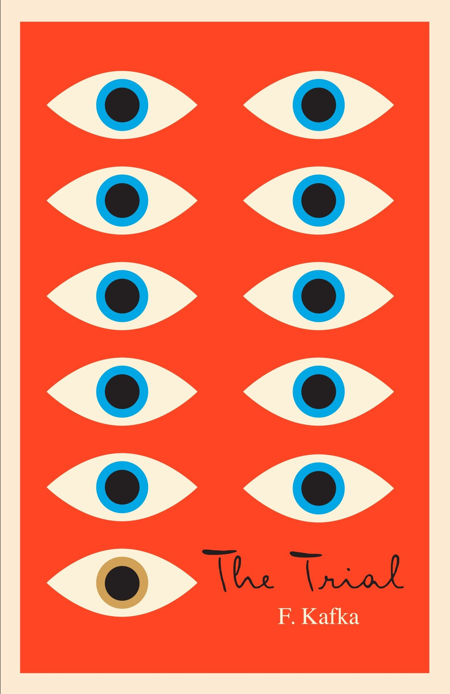
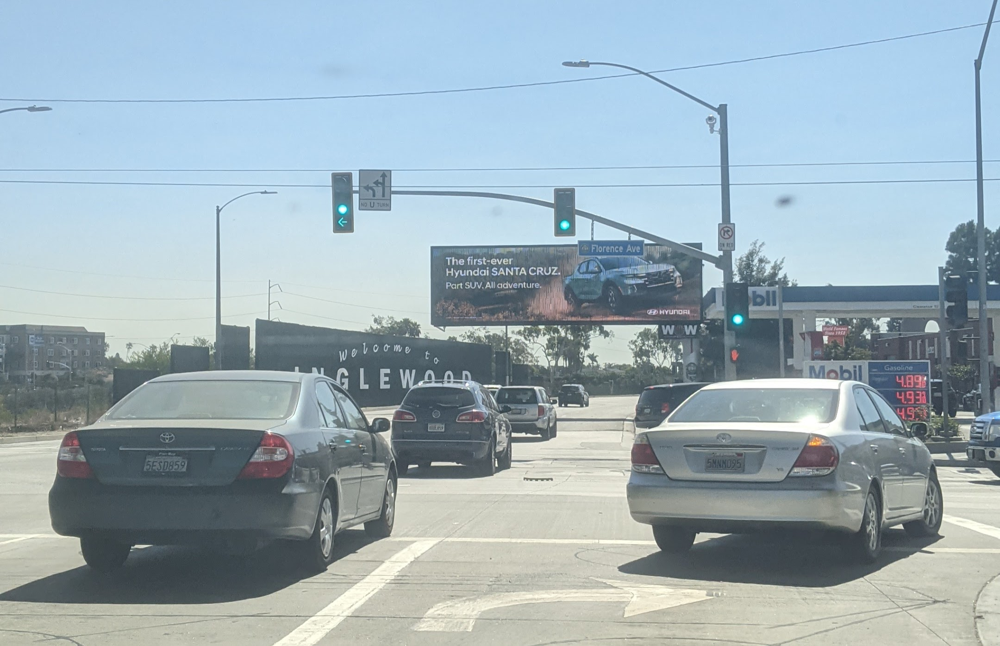

Thinking more about *The Trial* today.
I was listening to "Mystery of Iniquity (Unplugged)" by Ms. Lauryn Hill while on a drive, and it reminded me very strongly of the institution of the court in K.'s trial. 
Here are some of the lyrics:

```
Swearing by the bible blatantly blasphemous
Publicly perpetrating that "In God We Trust"
Cross-examined by a master manipulator
The faster intimidator
Receiving the judge's favor
Deceiving sabers doing injury to they neighbors
For status, gratis, apparatus and legal waivers
See the bailiff
Representing security
Holding the word of God soliciting perjury
The prosecution
Political prostitution
The more money you pay.. the further away solution
Legal actors
Babylon's benefactors
Masquerading as the agency for the clients
Hypocritical giants
Morally non-compliant
Orally armed to do bodily harm
Polluted, recruited and suited judicial charm
And the defense isn't making any sense
Faking the confidence of escaping the consequence
That a defendant is depending on the system
Totally void of judgment purposely made to twist em'
Emotional victim blackmailed by the henchmen
Framed by intentions
Inventions whereby they lynch men
Enter the false witness slandering the accused
Planting the seed openly showing he's being used
To discredit, edit, headed for the alleged
Smearing the individual fearing the unsuspected
Expert witness (the paid authority)
Made a priority to deceive the majority
Of disinterested peers
Dodging duty for years
Hating the process
waiting to be returning to their careers
Do we expect the system made for the elect
To possibly judge correct?
Properly serve and protect?
Materially corrupt
Spiritually amuck
Oblivious to the cause
Prosperously bankrupt
Blind leading the blind
Guilty never defined
Filthy as swine
A generation purin it's own mind
Legal extortion
Blown out of proportion
In vein deceit
The truth is obsolete
Only two positions:
Victimizer or Victim
Both end up in destruction trusting this crooked system
Mafia with diplomas keeping us in a coma trying to own a piece
of the "American Corona"
The Revolving Door
Insanity every floor
Skyscraping, paper chasing
What are we working for?
Empty traditions
Reaching social positions
Teaching ambition to support the family superstition?
When the Son of Podition is Commander in Chief
The standard is Thief
Brethren can we candidly speak?
Woe to the men
Trusted in the chariots dem'
Leaning on horses
They run their intellectual sources
Counterfeit wisdom creating the illusion of freedom
Confusion consumes them
Every word they speak it turns them out really white
Internally they absent of light
trapped in the night and bonded to the Cain of the night
Under the curse
Evil men waxing more worse
Faxing the first
Angelic being cast to the earth
It's time for rebirth
Burnin' up the branch and the root
The empty pursuits of every tree bearing the wrong fruit
Turning me ill
Let him who stole, no longer steal
Oh it's real
Surrender for Jehovah is real
How long will you sleep
Troubled by the thoughts that YOU keep
The idols YOU heap
Causing the destruction you reap
Judgment has come
Find it and return to the One
Abandon the flesh
Self-interest: Broadway to death
Pride and the Greed
Hide and subdividing the seed
The knowledge of Good and Evil is what caused us to lie
Caused us to die
Let your emotions be crucified
Renounce all your thoughts
Repent and let your mind be re-taught
You'll find what you soughtwas based on the deception you bought
A perception of naught
Where the majority remains caught
```

Jesus, if this is not masterful lyricism, then I don't know what is. 
Some versus that strike me as particularly relevant to *The Trial*:
- The more money you pay.. the further away solution
- And the defense isn't making any sense // Faking the confidence of escaping the consequence
- Expert witness (the paid authority) // Made a priority to deceive the majority // Of disinterested peers // Dodging duty for years //Hating the process // waiting to be returning to their careers
- The truth is obsolete // Only two positions: // Victimizer or Victim // Both end up in destruction trusting this crooked system
- The Revolving Door // Insanity every floor // Skyscraping, paper chasing // What are we working for?

---

I was looking at my eyes in the bathroom of Coffee Connection, and I realized that they have the same shape as the eyes on the cover of my edition of *The Trial*... ☹ reminds me of A telling me that I have "crazy eyes"... ☹



--- 

Saw something very dystopian-reminiscent today:



What the f? This billboard FORCES you to look at it, since it extends halfway across the freakin' street. 
How is this legal? This is one of those LED/digital billboards that have been popping up everywhere as of late. The ad before this one was BRIGHT blue and yellow and was extremely distracting on the road -- could you imagine what this would look like at night? 
How terrifying is it that advertising agencies and urban planners or whoever is responsible for this atrocity would perpetuate consumerism a manner that jeopardizes the safety of drivers? 
This is horrifying to me. 

---

Other random thoughts: saw a black butterfly with white winged tips today while playing ball with Darla, reminds me of catching butterflies in childhood and how the bushes seemed so tall then 
