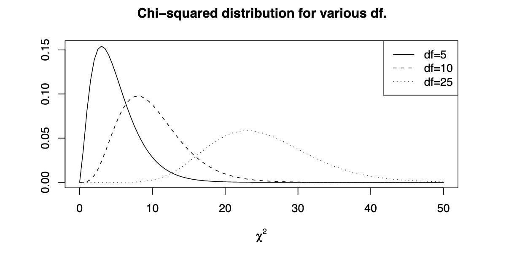

The chi-squared test is a statistical hypothesis test that is used to determine whether there is a significant difference between the observed and expected frequencies of one or more categories in a set of data.
Once more!
Given a hypothesis of what our data looks like (how it's _distributed_), the chi-squared test measures the difference between what we _observe_ and what we would _expect_.

The chi-squared test can only be used on _categorical_ (_i.e.,_ nominal, discrete) data — so yes to the number of people in a certain gender, race/ethnicity, or political category, but no to heights, weights, lengths (unless you discretize your data first).
Unlike other common hypothesis tests like the t-test, the chi-squared test is _non-parametric_, meaning that it does not rely on assumptions about the distribution of the data.
Instead, it measures whether the data is likely to be drawn from a given distribution.

The chi-squared test statistic has many talents—it can be used (_i.e.,_ interpreted) in numerous ways, such as:

-   the chi-squared test of homogeneity,
-   the chi-squared test of independence, and
-   the chi-squared goodness-of-fit test,
    the mechanisms of which will be shortly discussed.

## A Motivating Example

Let's say that we have gotten our curious hands on a dataset that consists of a random sample of two groups of people, $\text{Group A}$ and $\text{Group B}$.
For each observation in our dataset, we have information on whether that person has certain attributes — let's call them $\text{Attribute 1}$ and $\text{Attribute 2}$.
We may choose to summarize this data in a table like this:

$$
\begin{array}{c|ccc}
    \text{}         & \text{Attribute 1} & \text{Attribute 2} & \text{Total} \\ \hline \\
    \text{Group A}  & N_{a1}             & N_{a2}             & N_a \\ \\
    \text{Group B}  & N_{b1}             & N_{b2}             & N_b \\ \\
    \text{Total}    & N_1                & N_2                & N
\end {array}
$$

where $N_{ij}$ is the number of people in group $i$ that have attribute $j$.
A natural and solid thing for a wandering mind to consider at this point is: are the two groups different (with respect to the two attributes)?
Or are they similar?
What a loaded question!

Let's suppose for a second that the two groups are similar.
Then, we would expect that the probability for a person to have a certain attribute is the same, regardless of what group they are in.
We don't know what the _true_ probabilities are (or we wouldn't need to ask these questions at all!), so let's make an educated guess given the data that we have.
We will use

$$
p_1 = \frac{N_1}{N}, \text{ the probability for a person in our dataset to have attribute $1$} \\ \hphantom{1} \\
p_2 = \frac{N_2}{N}, \text{ the probability for a person in our dataset to have attribute $2$}
$$

Given these probabilities, we can calculate the number of people that we might expect to see with a given group/attribute combination.
Let's give a more concrete example here:

> Suppose that the probability of a person having attribute $1$ is $p_1 = 0.3$.
> If there are $N_a = 100$ people in group $A$, how many people would we expect to see in group $A$ that have attribute $1$?

We would expect to see $N_ap_1 = 100(0.3) = 30$ people with that group/attribute combination.
We can generalize this to conclude that the _expected value_ of the frequency of people in group $i$ with attribute $j$ is

$$
\mathbb{E}_{ij} = N_ip_j = N_i (\frac{N_j}{N}) =  \frac{N_iN_j}{N}
$$

Let's lay out what we have so far in two tables:

$$
\begin{array}{c|ccc}
    \textbf{Observed} & \text{Attribute 1} & \text{Attribute 2} \\ \hline \\
    \text{Group A}    & N_{a1}             & N_{a2}             \\ \\
    \text{Group B}    & N_{b1}             & N_{b2}             \\ \\
\end {array}
\hspace{5em}
\begin{array}{c|ccc}
    \textbf{Expected} & \text{Attribute 1} & \text{Attribute 2} \\ \hline \\
    \text{Group A}    & \mathbb{E_{a1}}    & \mathbb{E_{a2}}    \\ \\
    \text{Group B}    & \mathbb{E_{b1}}    & \mathbb{E_{b2}}    \\ \\
\end {array}
$$

If we were right in our assumption and the two groups are similar, we would expect the observed and expected values to be very close together!
In other words, the _difference_ between the observed and expected values, $N_{ij}-\mathbb{E}_{ij}$, should be very small.
So, let's add up these differences:

$$
(N_{a1}-\mathbb{E}_{a1}) + (N_{a2}-\mathbb{E}_{a2}) + (N_{b1}-\mathbb{E}_{b1}) + (N_{b2}-\mathbb{E}_{b2}) = \sum_{i,j} (N_{ij}-\mathbb{E}_{ij})
$$

But wait! There's a problem here!
Let's say that the difference for one combination is $-1000$ and the difference for another is $1000$.
These are both signifying that the observed and expected values are very different.
But when we add the two together, we get that the total difference is $0$!
This can't be right — what we need is for a big difference to have a big value.
So, let's solve this by squaring each difference:

$$
\sum_{i,j} (N_{ij}-\mathbb{E}_{ij})^2
$$

Ah, much better.
But we look at it one more time, narrow our eyes, and realize that something else isn't quite right.
Let's say that our dataset has many more people in group $A$ than in group $B$.
Then, the expected value for one attribute in group $A$ would be bigger than the value for group $B$ — perhaps $1000$ for $A$ and $100$ for $B$.

Now suppose that the difference in observed and expected values for this attribute is $200$ for $A$ and $50$ for $B$.
The difference for $A$ _looks_ much worse at first glance, but we realize that it's not as bad as the difference for $B$: the difference for $A$ is only $20\%$ of the expected value, but the difference for $B$ is a whopping $50\%$!
So, we have to account for the size of the groups in our calculations.
We will _normalize_ the data by dividing our squared difference by the expected value:

$$
\sum_{i,j} \frac{(N_{ij}-\mathbb{E}_{ij})^2}{\mathbb{E}_{ij}}
$$

And we sigh in relief.
Let's summarize our process:

-   We started with data that is split into categories (in this case, group/attribute combinations).
-   We made a hypothesis about the distribution of our data (in this case, that the two groups have the same probabilities of having an attribute).
-   We used these hypothesized probabilities to calculate the data that we would expect if our hypothesis were true.
-   We calculated the magnitude of the difference between what we observe and what we expect, controlling for size.
    Congratulations, we have just recreated Pearson's chi-squared test statistic!

## Definition of Pearson's Chi-Squared Test Statistic

In slightly different notation, we can define Pearson's chi-squared test statistic as follows:

$$
\begin{align*}
    &\textbf{Definition 1 (Pearson's chi-squared test statistic)}
     \text{ Let $X_1, \ldots, X_n$ be $n$ independent and identically-distributed (i.i.d.)} \\
    &\text{observations, each of which belongs to one of $k$ categories. Pearson's chi-squared test statistic is defined as} \\
\end{align*} \\
\begin{align*}
               \Chi^2 &= \sum_{i=1}^k \frac{(O_i - E_i)^2}{E_i} \text{,} \\
    \text{where } O_i &= \text{the observed frequency of the $i$th category, and} \\
                  E_i &= \text{the expected frequency of the $i$th category.}
\end{align*}
$$

In 1900, Karl Pearson published a paper titled _On the criterion that a given system of deviations from the probable in the case of a correlated system of variables is such that it can be reasonably supposed to have arisen from random sampling_ (someone get this man an editor!), in which he proposed that as the number of observations goes to infinity (as $n \to \infty$), the test statistic $\Chi^2_n$ converges in distribution to the $\chi^2$ distribution.

$$
\begin{align*}
    &\textbf{Theorem 1 (Pearson's theorem)}
     \text{ The random variable}
\end{align*} \\
\Chi^2 = \sum_{i=1}^k \frac{(O_i - E_i)^2}{E_i} \longrightarrow^d \chi^2_{k-1} \text{,} \\
\text{\textit{i.e.,} converges in distribution to the $\chi^2$ distribution with $k-1$ degrees of freedom.}
$$

Why is this helpful in any way?
The basic premise is that now that we know it converges to a specific distribution, we can calculate _how likely_ it is that we end up with a specific value for our test statistic $\Chi^2$.

## The Chi-Squared Distribution

Let's look a little more closely at the chi-squared distribution.
As we alluded to in the previous section, each chi-squared distribution is associated with a parameter called the _degree of freedom_.
The degree of freedom is the maximum number of independent variables in the system, _i.e.,_ the number of parameters that are allowed to vary.[^dof]
We can see what chi-squared distributions for various degrees of freedom look like:

^[{-} Fig. 1. From Anthony Tanbakuchi; [Tests of independence and homogeneity](http://www.u.arizona.edu/~kuchi/Courses/MAT167/Files/LH_LEC.0640.HypTest.IndepHomog.pdf)]

[^dof]: For example, let's say that you have a dataset of 10 counts. You know that the total count is 100. How many counts are you allowed to vary before you know the state of the dataset? You can vary 9 freely — but once you set those 9, you immediately know the 10th value (because the total must add up to 100). This system would have 9 degrees of freedom.

<!-- [^dof-caption]: Source:  -->

<!--
Let's suppose for a second that the two groups are similar.
Then, we might expect them to have the same amount of people with attribute $1$ and attribute $2$.
Wait, that's not exactly right — what if there are 100 people in group $A$ and only 10 people in group $B$?
Group $A$ would very likely have more people with attribute $1$ or $2$ just by virtue of being a bigger group, not by virtue of the groups being dissimilar!
Then, it might be better to compare *proportions*: the number of people with a certain attribute divided by the total number of people.
That way, we have *normalized* the data by the size of the group.

So, we would hypothesize that the proportion of people with a certain attribute is the same between groups.
What would those hypothesized proportions be?
Unfortunately, we don't have access to the *true* values — if we did, then we wouldn't need to ask these questions at all!
Perhaps the best that we can do is use the data that we have.
The most representative data (of the population) that we have are the total number of people with each attribute, so let's assume that the true probability of a person having attribute $i$ is the number of people in our data with attribute $i$ divided by the number of total people in our data.
So, we define the following probabilities:
$$
p_1 = \frac{n_1}{n}, \text{ the proportion of people with attribute $1$} \\ \hphantom{1} \\
p_2 = \frac{n_2}{n}, \text{ the proportion of people with attribute $2$}
$$

Alright, so now we can proceed with the assumption that the probability that a person has attribute $i$ is $p_i$, regardless of which group they belong to.
If this is true, how many people would we expect to see with each group/attribute combination?
Let's give a more concrete example here:
> Suppose that the probability of a person having attribute $1$ is $p_1 = 0.3$.
> If there are $n_a = 100$ people in group $A$, how many people would we expect to see in group $A$ that have attribute $1$?
We would expect to see $n_ap_1 = 100(0.3) = 30$ people with that group/attribute combination.
We can generalize this to conclude that the *expected value* of the frequency of people in group $i$ with attribute $j$ is
$$
n_ip_j = n_i (\frac{n_in_j}{n}) =  \frac{n_in_j}{n}.
$$

What would it mean for the two groups to be similar?
Well, you might expect them to have the same amount of people with attribute $1$ and attribute $2$.
Wait, that's not exactly right — what if there are 100 people in group $A$ and only 10 people in group $B$?
Group $A$ would very likely have more people with attribute $1$ or $2$ just by virtue of being a bigger group, not by virtue of the groups being dissimilar!
Then, it might be better to compare *proportions*: the number of people in a group with a certain attribute divided by the total number of people in the group.
That way, we have *normalized* the data by the size of the group.

So, let's define
$$
p_1 = \frac{n_1}{n}, \text{ the proportion of people with attribute $1$} \\ \hphantom{1} \\
p_2 = \frac{n_2}{n}, \text{ the proportion of people with attribute $2$}

Then, we can now ask: is the proportion of people in group $A$ with attribute $1$ the same as the proportion of people in group $B$ with attribute $1$?
How about attribute $2$?
How would one approach an answer to this question?

What would we *expect* to see if they were the same?
We would probably expect to see that they have the same proportions.
So, do we just compare the proportions that we've calculated?

Let's clarify one thing.
Remember that
$$ -->
